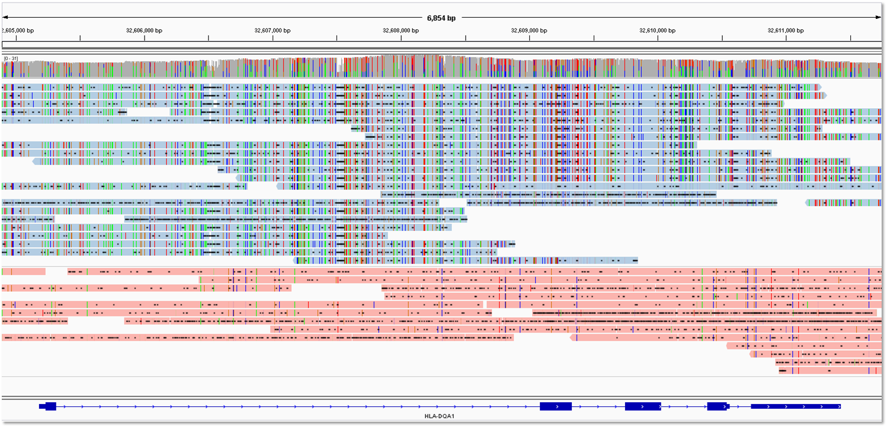

# targeted-sequel-phasing.sh - Sequel and SMRT Link >4.0
-------------------------

## `capture2target.py PROBE.BED FRAG_SIZE`
```
Generates a bed file containing target regions based on probe positions.  A target region is defined as a
the region from (PROBE START - FRAG SIZE) to (PROBE END + FRAG SIZE).  If two probes are separated by
<= 2 * FRAG SIZE, these are consolidated into on region.

PROBE.BED - bed file describing probe coordinates
FRAG_SIZE - mean fragment size, used to determine the largest regions that could be phased
```

## `generate_jobs.py TARGETBED CCSBAM SUBREADSBAM SUBREADSALIGNED_BOOL REFERENCE`
```
Generates a shell script for each region of interest in the bed file.  These scripts can be submitted to
a job management system like sge or slurm, or executed locally using GNU parallel or something similar.

TARGET.BED - regions of interest, either hand-created or created from probe bed file using capture2target.py
CCSBAM - mapped CCS
SUBREADSBAM - SUBREADS
SUBREADSALIGNED_BOOL - True if SUBREADSBAM is aligned.  Otherwise False.  If False, extra time will
	be required for subread alignment after phasing.
REFERENCE - reference fasta (indexed by samtools)
```

## `phaseout2bed.py PHASEOUT`
```
Generate a bed file describing the haplotype blocks determined during phasing.

PHASEOUT - phase.out file created by samtools phase step
```

## Installing
----------
Clone with git.

## Running
----------
```sh
# add folder to path
cd targeted-phasing-consensus
export PATH=$PWD:$PATH

# define some variables to make this easier to read
CCSBAM = /path/to/your/mapped/ccs.bam
SUBREADSBAM = /path/to/your/subreads.bam  # prefer aligned subreads with reseq
SUBREADSALIGNED = True                    # or False
REF = /path/to/reference/genome           # with indices

# produce a bed file named capture_probes.bed.targets with the target regions of interest
capture2target.py capture_probes.bed

# generate shell scripts to phase each region of interest
generate_jobs.py ./capture_probes.bed.targets $CCSBAM $SUBREADSBAM $SUBREADSALIGNED $REF

# if running locally without a cluster
NUM_CORES = 8 # set this to the number of concurrent jobs
parallel -j $NUMCORES 'bash {} > {}.out' ::: phase_*.sh

# if running on a cluster, edit QSUB_HEADER in generate_jobs.py with whatever you need, and
parallel 'qsub {}' ::: phase_*.sh
```




# targeted-sequel-phasing.sh - Sequel and SMRT Link >4.0
-------------------------

The ``targeted-sequel-phasing.sh`` script phases, aligns, and generates phased consensus sequences for CCS reads in a given region of interest.

## Installing
----------

Download these two files into the same directory:

```sh
% wget https://github.com/lhon/targeted-phasing-consensus/raw/master/targeted-sequel-phasing.sh
% wget https://github.com/lhon/targeted-phasing-consensus/raw/master/faidx.zip
```

Running `targeted-sequel-phasing.sh` requires having [SMRT Link >4.0](http://pacbiodevnet.com) installed.

## Running
-------

1. In SMRT Link, use "CCS Mapping" to map reads to reference and produce CCS bam.

2. Use ``dataset consolidate`` to produce a conslidated consensus alignment bam.

3. You will need the file locations of:
	- consolidated consensus alignment bam
	- subreads bam
	- scraps bam
	- reference fasta

4. Run `targeted-sequel-phasing.sh` on your targeted region using position arguments:
```
CCSBAM=$1
SUBREADSBAM=$2
SCRAPSBAM=$3
ROINAME=$4
CHROM=$5
START=$6
END=$7
REF=$8
```
Example:
```
bash ./targeted-sequel-phasing.sh /path/to/ccs.bam /path/to/subreads.bam /path/to/scraps.bam BRCA1 chr17 41243000 41244200 /path/to/reference.fasta
```

In the example above, we are looking at a subset of `BRCA1` on `chr17` between positions `41243000` and `41244200`.

## Outputs
-------

Some relevant files in the output directory:

- `subset.bam` is the subset of the full BAM file containing reads mapping to the region of interest.
- `phase.out` is the output from the `samtools phase` command. Successfully phased regions are delineated by the `PS` (phase set) marker. `M1` describes detected heterogyzote SNPs that passed the filter.
- `phase.0.consensus.fasta` and `phase.1.consensus.fasta` are the consensus sequences for each phase, generated by Arrow.
- `nucmer.snps` shows the SNP differences between the phases.


# targeted-phasing-consensus.sh - RSII and SMRT Analysis 2.3.0
-------------------------

The ``targeted-phasing-consensus.sh`` script runs phasing on a subset of aligned PacBio Reads of Insert (CCS reads) corresponding to a gene or region of interest, and generates a Quiver-based consensus sequence for each phase.

This workflow was designed for experiments utilizing long fragment target capture, such as the upcoming 6 kb capture protocol using Roche NimbleGen’s<sup>&reg;</sup> SeqCap EZ Enrichment<sup>&reg;</sup>.

## Installing
----------

Download these two files into the same directory:

```sh
% wget https://github.com/lhon/targeted-phasing-consensus/raw/master/targeted-phasing-consensus.sh
% wget https://github.com/lhon/targeted-phasing-consensus/raw/master/faidx.zip
```

Running `targeted-phasing-consensus.sh` requires having [SMRT Analysis 2.3.0](http://pacbiodevnet.com) installed.

## Running
-------

1. In SMRT Portal, use the `RS_ReadsOfInsert_Mapping` protocol with the following parameters to generate and align single best estimate Reads of Insert per molecule:
   - Minimum Full Passes: 0
   - Minimum Predicted Accuracy: 75

2. The name of the reference, `aligned_reads.bam`, and `input.fofn` from Step 1 can then be used for the phasing step. `source` the SMRT Analysis environment, and then run `targeted-phasing-consensus.sh` on a targeted region:

  ```sh
% source /opt/smrtanalysis/etc/setup.sh
% ./targeted-phasing-consensus.sh chr17 41243000 41244200 BRCA1 hg19_M_sorted /opt/smrtanalysis/common/jobs/087/087197/data/aligned_reads.bam /opt/smrtanalysis/common/jobs/087/087197/input.fofn
```

  In the example above, we are looking at a subset of `BRCA1` on `chr17` between positions `41243000` and `41244200`. `hg19_M_sorted` was the name of the reference in SMRT Portal, and the paths to `aligned_reads.bam` and `input.fofn` from job 87197 were specified. The results and intermediate output will be placed in the `BRCA1` subdirectory.

## Outputs
-------

Some relevant files in the output directory:

- `subset.bam` is the subset of the full BAM file containing reads mapping to the region of interest.
- `phase.out` is the output from the `samtools phase` command. Successfully phased regions are delineated by the `PS` (phase set) marker. `M1` describes detected heterogyzote SNPs that passed the filter.
- `consensus0.fasta` and `consensus1.fasta` are the consensus sequences for each phase, generated by Quiver.
- `nucmer.snps` shows the SNP differences between the phases.
