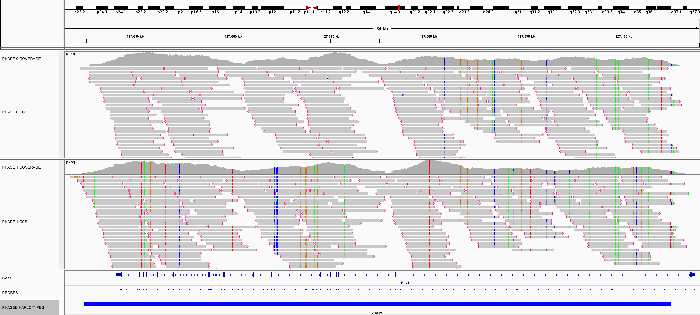
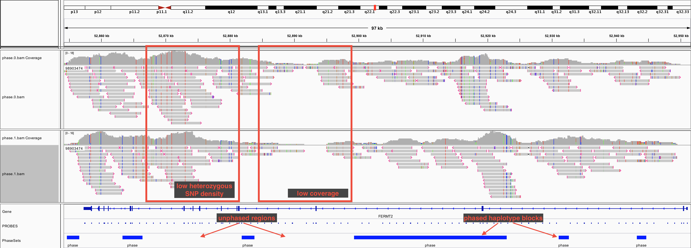

# `targeted-sequel-phasing`
-------------------------

-------------------------
This is a collection of tertiary analysis scripts written to facilitate phasing and generating haplotype consensus sequences for PacBio target capture data.
These scripts are not officially supported by Pacific Biosciences.

## Requirements:
- smrttools or SMRT Link >= 5.0.1
- `samtools` >= 1.3.1
- `egrep`, `awk`, `cut`, `xargs`, `sed`
- optional: `parallel`<sup id="a1">[1](#f1)</sup>

## About:
Phased sequences provide:
- Direct evidence of linked mutations
- Allele-specific profile of SNPs, insertions, deletions, and other structural variations
- Improved downstream variant interpretation and haplotype calls with allelic resolution
- Improved assignment of corresponding splice isoforms to specific alleles

## Installation:
Clone with git.  Ensure that you have all of the dependencies available in your path.

## Input:
In order to phase reads using these scripts, you will need:
- a reference genome: If you have a SMRT Link installation, you can point to the path of the .fasta or .fa file.  If not, you will need to download or create a reference and run [`samtools faidx`](http://www.htslib.org/doc/samtools-1.3.1.html "Samtools Documentation")` /path/to/reference/fasta` to build a genome index.
- a consolidated<sup id="a2">[2](#f2)</sup> CCS BAM with reads aligned to reference genome:  This can be created with a SMRT Link "CCS Mapping" job.  We have had success with the default settings:
    - Minimum Number of Passes: 3
    - Minimum Predicted Accuracy: 0.9
- an consolidated<sup>[2](#f2)</sup> subreads BAM with reads aligned to reference genome:  This can be created with a SMRT Link "Resequencing" job.  We have had success with the default settings.
- a BED file describing either of the following:
    - the target regions you wish to phase, or
    - the positions of the probes.  If you choose this option, `capture2target.py` can be used to generate a target region BED file.


## Tutorial:
### Phasing a single target region.
Within a given region of interest, the general workflow of the `targeted-sequel-phasing.sh` script is:
1. Subset the CCS bam around the region of interest.
2. Phase the CCS reads in this region using [`samtools phase`](http://www.htslib.org/doc/samtools-1.3.1.html "Samtools Documentation").
3. Generate a BED file describing the phased haplotype blocks within the region of interest.
4. For each phase:
    1. Generate a list of ZMWs in the phased CCS bam.
    2. Filter aligned subreads using ZMW list to generate aligned subread bam.
    3. Generate consensus fasta and vcf from aligned subreads using `arrow`.

```sh
# in this example, we will be phasing the a region around the BIN1 locus in hg38
# add script folder to path
cd targeted-phasing-consensus
export PATH=$PWD:$PATH

# create a working directory and change into it, e.g.
mkdir ~/phased_data
cd ~/phased_data

# define some variables to make the command easier to read (optional)
CCSBAM=/path/to/your/mapped/ccs.bam     # ccs reads must be aligned to reference
SUBREADSBAM=/path/to/your/subreads.bam  # subreads must be aligned to reference
REFERENCE=/path/to/reference/fasta      # with indices
ROINAME=BIN1                            # this shouldn't contain any punctuation other than underscore or dash
CHROM=chr1                              # define $CHROM, $START, and $END as if you would be passing them to samtools
START=127042513
END=127113327

# run the phasing script, passing the necessary arguments
targeted-sequel-phasing.sh $CCSBAM $SUBREADSBAM $ROINAME $CHROM $START $END $REFERENCE
```

### Phasing multiple target regions.
With the included `capture2target.py` and `generate_jobs.py` scripts, you can phase all regions for a set of probes at once.  The general workflow is:
1. Generate a BED file of target regions that you would like to phase by either:
    1. manually creating a tab-delimited BED file containing:
        - column 1: chromosome for region of interest (ex. `chr1`)
        - column 2: starting position for region of interest(ex. `127042513`)
        - column 3: ending position for region of interest (ex. `127113327`)
        - column 4: region name, without any spaces or punctuation other than underscores and dashes (ex. `BIN1`)
    2. passing your probe set BED file through the included `capture2target.py` script.  This will join probes that are separated by fewer bases than twice the fragment size, and add a buffer to the end of each region to capture all of the reads mapping to the region.
2. Call `generate_jobs.py` to generate a shell script for each entry in the target region BED file.  If you intend to run these jobs on a cluster, you may need to edit the `CLUSTER` and `CLUSTER_HEADER` variables in `generate_jobs.py` before executing.
3. Run the scripts generated in step 2.  These can be run locally (using `parallel` or a `for` loop for convenience) or submitted to your cluster.  Each of these scripts follows the workflow above for phasing a single target region.  If you save these shell scripts, they can be run again in the future to regenerate the data.

```sh
# add script folder to path
cd targeted-phasing-consensus
export PATH=$PWD:$PATH
# ensure that samtools and arrow are in your path
samtools --version  # should report >= 1.3.1
arrow --version     # should report >= 2.2.0

# create a working directory and change into it, e.g.
mkdir ~/phased_data
cd ~/phased_data

# define some variables to make this easier to read
CCSBAM=/path/to/your/mapped/ccs.bam     # ccs reads must be aligned to reference
SUBREADSBAM=/path/to/your/subreads.bam  # subreads must be aligned to reference
REFERENCE=/path/to/reference/fasta      # with indices
FRAG_SIZE=6000                          # determined by mean fragment size during prep; 2kbp to 6kbp recommended

# produce a BED file named capture_probes.bed.targets with the target regions of interest
capture2target.py capture_probes.bed $FRAG_SIZE

# generate shell scripts to phase each region of interest
generate_jobs.py ./capture_probes.bed.targets $CCSBAM $SUBREADSBAM $REF


# CHOOSE ONE OF THE TWO FOLLOWING OPTIONS:

    # 1) if running locally without a cluster you can launch all of the jobs from parallel
    # parallel will manage the number of jobs running concurrently if you provide the '-j NUMBER` argument:
    NUM_CORES=8 # set this to the number of concurrent jobs
    parallel -j $NUM_CORES 'bash {} > {}.out' ::: phase_*.sh

    # 2) if running on a cluster, edit QSUB_HEADER in generate_jobs.py with whatever you need, and start them with parallel or a loop:
    parallel 'qsub {}' ::: phase_*.sh
```

## Output:
# Files and folder organization:
Within the working directory, there will be a new folder for each target region.  Within each of these folders, there will be:
- `subset.bam`: reads overlapping the target region<sup id="a3">[3](#f3)</sup>
- `phase.[01].bam`: phased CCS reads<sup id="a4">[4](#f4)</sup>
- `phase.[01].subreads.bam`: phased subreads<sup>[4](#f4)</sup>
- `phase.[01].consensus.fasta`: phased consensus fasta<sup>[4](#f4)</sup>
- `phase.[01].vcf`: phased variant calls<sup>[4](#f4)</sup>
- `phase.out`: output of `samtools phase`, which describes the phase blocks, markers, and supporting reads
- `phase.bed`: BED file created using `phase.out`; can be loaded into IGV to graphically display phased regions and markers

## Visualization of phased CCS reads and haplotype blocks:
We view the output using [IGV 2.4 beta](http://software.broadinstitute.org/software/igv/igv2.4beta) from [Broad Institute](https://www.broadinstitute.org/).<sup id="a5">[5](#f5)</sup>
- Ensure that you pick the same reference genome used for alignment.
- File -> Load from File... -> Choose `phase.0.bam`, `phase.1.bam`, and `phase.bed`


## Possible improvements:
- accept dataset (.xml) input in place of consolidated BAM
- trim BAM, consensus FASTA, and SNP VCF files to phased regions
- call structural variants on phased BAM and produce phased SV VCFs

## Notes:
- <b id="f1">1</b> [GNU parallel](https://www.gnu.org/software/parallel/) is a great tool to simplify your workflow.  Refer to the [man page](https://www.gnu.org/software/parallel/man.html) for more information.[↩](#a1)
- <b id="f2">2</b> If you start with a dataset spread over multiple BAM files, you can consolidate these using the [`dataset consolidate`](http://www.pacb.com/wp-content/uploads/SMRT-Tools-Reference-Guide-v4.0.0.pdf) command.[↩](#a2)
- <b id="f3">3</b> We have found that local coverage values between 60x and 120x tend to produce the largest haplotype blocks, so the script downsamples if the average coverage is greater than `$MAX_COVERAGE` in `targeted-sequel-phasing.sh`.  By default, `MAX_COVERAGE=120`.[↩](#a3)
- <b id="f4">4</b> `phase.0` and `phase.1` are arbitrary naming assignments, and since a given target region may contain multiple phased haplotype blocks which may not be linked to each other, you should take care when interpreting the data.[↩](#a4)
- <b id="f5">5</b> For suggested alignment view settings, refer to Figure 1 and Figure 2 in [this blog post](http://www.pacb.com/blog/igv-3-improves-support-pacbio-long-reads/).[↩](#a5)
